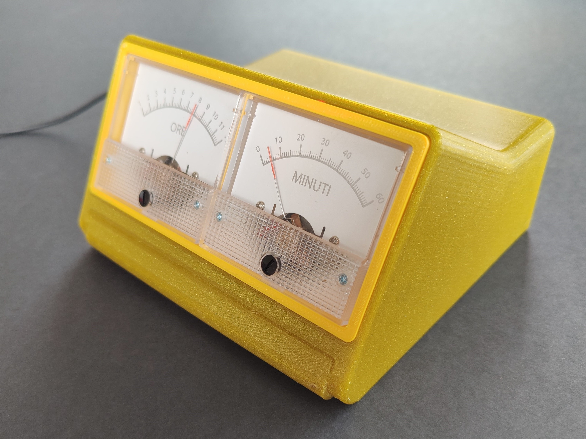
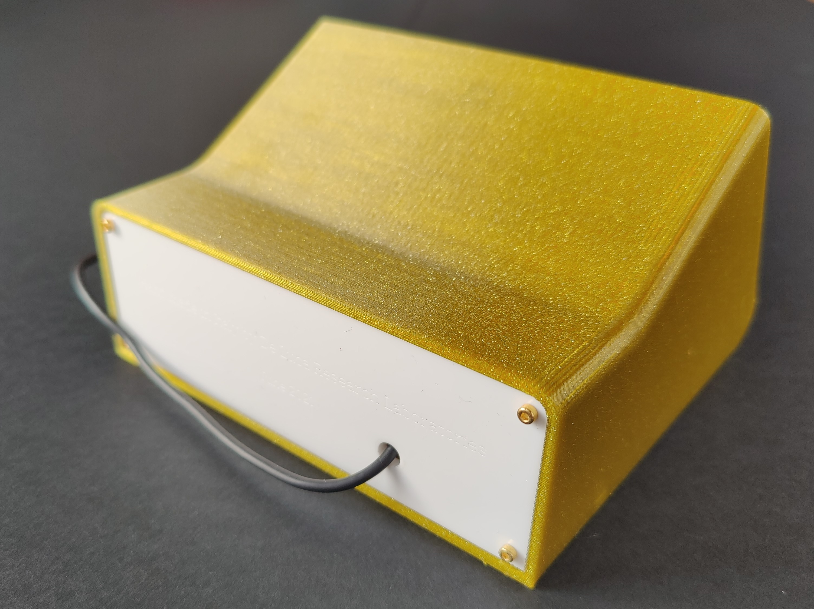
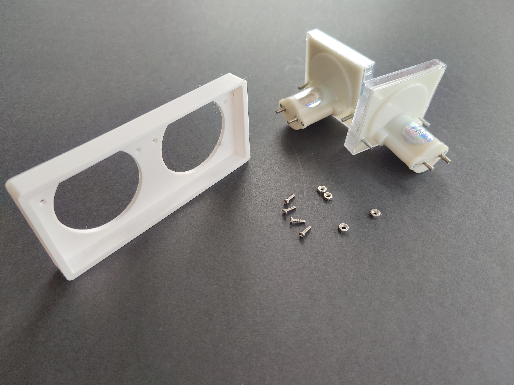
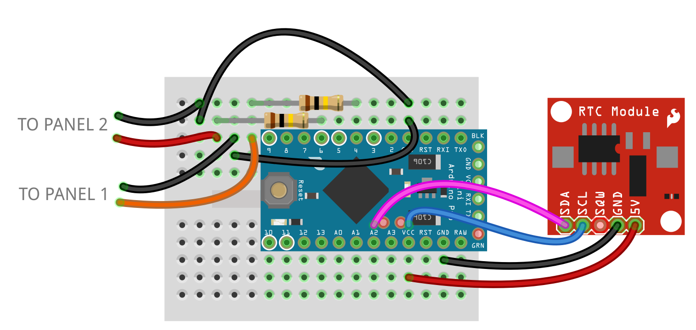
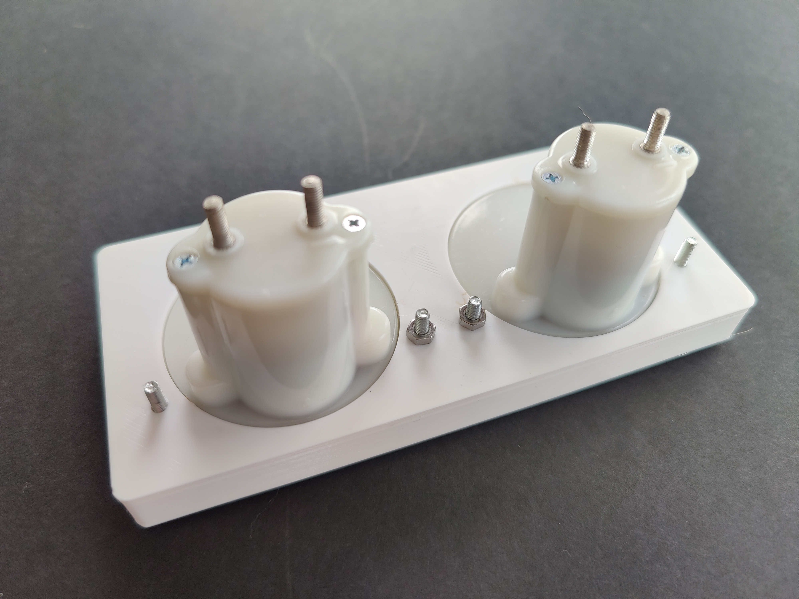
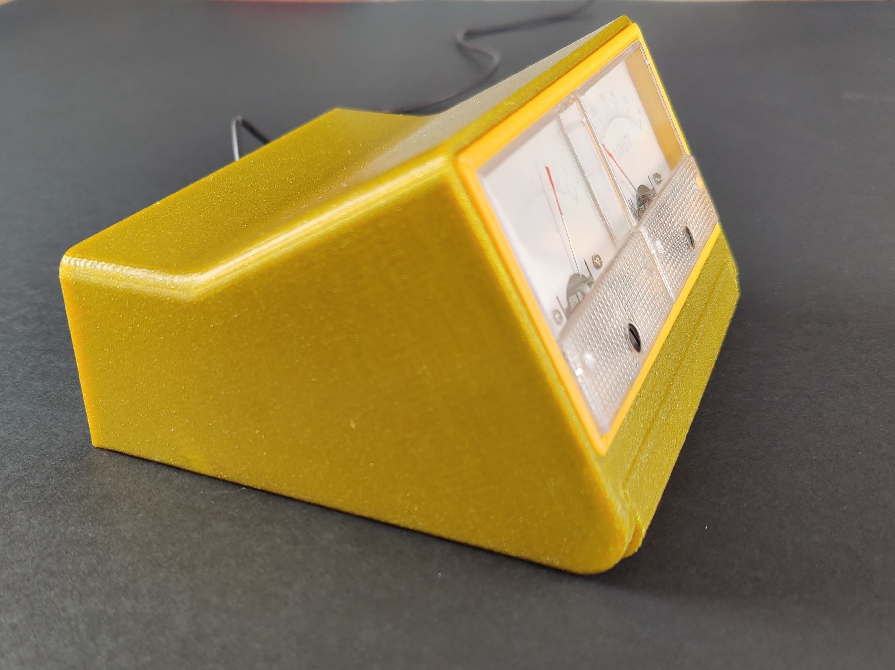
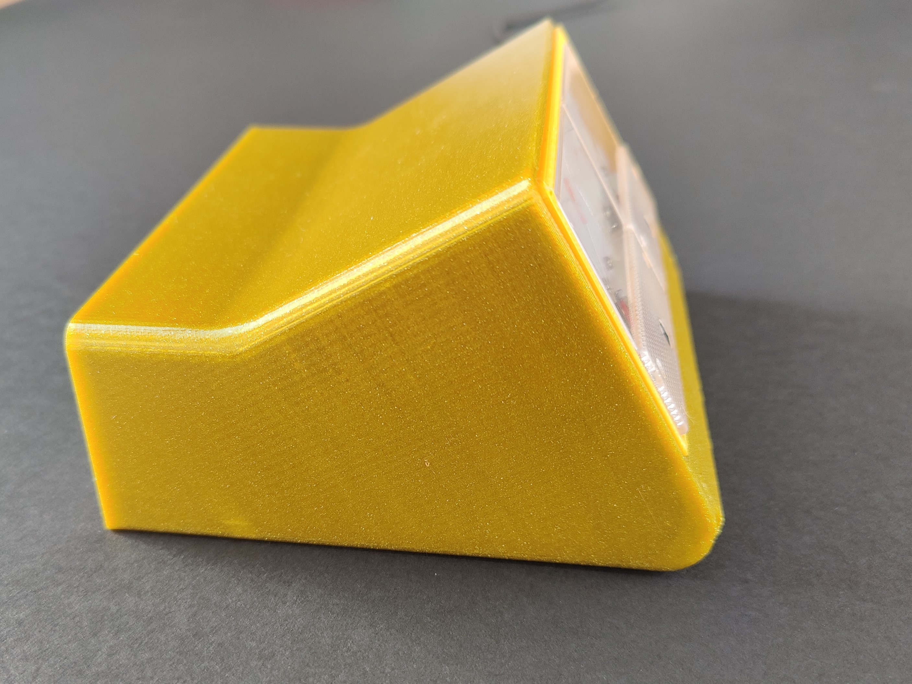

# Panel Meter Clock by DeLucaLabs

I’ve first seen a clock that uses panel instruments to display time on twitter, then after a quick search in the internet I found lots of similar projects, but every one focused on the electronics and not on the design/look of the clock itself

I decided to design this clock with ideas from some of the most iconic electronics devices of the 60s and 70s, like for example the Brionvega Agol TV or the Braun LED DN 40 Clock.

My version uses two 50uA current meters from AliExpress, that with a voltage 0-5V and a series resistor of 100KOhm (or a series between a 82KOhm resistor and a 20KOhm potentiometer for better tuning) can simply display everything you want to output.

| Front | Back |
|--------|--------|
| | |

Find additional info about each part of the design in:
* <a href="https://github.com/lorenzo-dl/Panel_meter_clock_ByDelucalabs/tree/main/3d">3D parts</a>
* <a href="https://github.com/lorenzo-dl/Panel_meter_clock_ByDelucalabs/tree/main/other%20files">Other design files</a>
* <a href="https://github.com/lorenzo-dl/Panel_meter_clock_ByDelucalabs/tree/main/images">Images</a>

# Parts list
- Printed parts
- Laser cutted parts(only if you have cutted the back plate)
- Electronic parts, see the next list
- 4x M2x8 skrew to secure the back plate
- 4x M3 nuts (sometimes included with the metes)

 

# Electronic parts list
- jumper cables
- 1x Arduino Pro Mini (with a programmer) or 1x Arduino Nano (programmer included)
- 1x DS1307 board for Arduino (https://it.aliexpress.com/item/32572449320.html)
- 2x 50uA current meters (https://it.aliexpress.com/item/1005002059808292.html)
- 1x small breadboard (https://www.amazon.com/Eiechip-Breadboard-solderless-breadboard-Arduino/dp/B07RSBPFN7)
- 2x 100KOhm 1/4W resistor  
[or 2x 82KOhm 1/4W resistor and 2x 20KOhm potentiometer (for precision adjust)]

# Print Settings

I’ve printed all of the parts of this clock out of Prusament PETG, with an original Prusa MK3S with the powder coated bed for the 3d printed parts. 

I used Prusa Slicer to create the attached gcodes.

All the stls are in the right orientation.

The back plate can be laser cutted or 3d printed, all the files are included.

Prints the following parts:
- 1x PanelMeterClock_v1_Body: Prusament PETG, Preset 0.2mm SPEED, support only for the internal support brakets, 3 wall
- 1x PanelMeterClock_v1_displayHolder: Prusament PETG, Preset 0.2mm SPEED, no support
- 1x PanelMeterClock_v1_BackPanel (if not laser cutted): Prusament PETG, Preset 0.3mm DRAFT, no supports

the clock in the photos uses Prusament PETG Yellow Gold for the body and Prusament PETG Mango Yellow for the display holder

# Changing the scale on the current meters

There are two possible ways to change the scale of the two meters.

The first and simplest one is to print on a sheet of paper the two faces (pdf 1:1 scale included), cut them to shape and glue them on top of the original meter scale.

The other method requires a co2 laser and consist in painting the back of the original metal scale with a white acrylic spray, and then remove some of the paint with the laser (.ai file included, the .pdf file can also be used)

# Assembly instruction 

Connect the circuit as the diagram shows and upload the included sketch to the Arduino to test the circuit.

Print the parts and assemble the panels in the PanelMeterClock_v1_displayHolder and secure them with the nuts only on the two screws in the middle as shown in the next image.

ATTENTION!!! The following step can be a little tricky, is possible to do it but require patience.
Put now the PanelMeterClock_v1_displayHolder into the PanelMeterClock_v1_Body and secure the remaining bolts on the external screw as shown in the picture below.

Now close the back panel with the four M2 bolts and enjoy your clock.

### licensing and contacts
Thank you for reading and your interest, if you want more details feel free to visit the project <a href="https://github.com/lorenzo-dl/Panel_meter_clock_ByDelucalab">GitHub page</a> or contact me on Instagram <a href="https://www.instagram.com/delucalabs/">@delucalabs</a>.

This design is licensed under a :<a href="https://creativecommons.org/licenses/by-nc/4.0/">Creative Commons (4.0 International License) Attribution-NonCommercial</a>.

If you find this design useful, please consider a donation via <a href="https://paypal.me/LDL11">paypal.me/LDL11</a> for supporting new designs and further development. Thanks.

